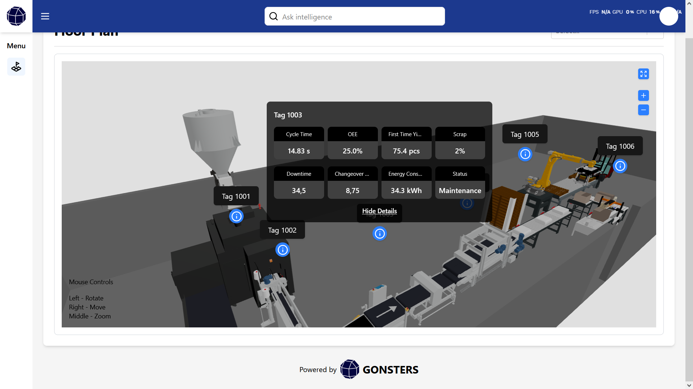

# 🏭 Mini App 3D Factory Floor Plan — Frontend with Vite + React Three Fiber + Tailwind CSS

This is a **mini interactive 3D application** that visualizes a factory floor layout with clickable machine tags. Built with **Vite**, **React**, **TypeScript**, **React Three Fiber**, and **Tailwind CSS**, the app allows users to explore a 3D scene, interact with machine markers, and view simulated real-time data.

---

## 🛠️ Tech Stack

- **Vite** – Fast bundler for modern frontend development
- **React** – UI library for building interactive components
- **TypeScript** – Type-safe JavaScript
- **React Three Fiber** – React renderer for Three.js
- **Three.js** – 3D graphics library
- **@react-three/drei** – Helpers for R3F (GLTF loader, controls, HTML overlay)
- **Tailwind CSS** – Utility-first CSS framework

---

## ✨ Features

- 🧭 3D interactive factory floor using `.glb` model
- 🏷️ Clickable machine tags with simulated performance data
- 🪟 Tooltip/info panel that follows camera and adapts position
- 🔄 Expandable data panel with metrics (Cycle Time, OEE, Downtime, etc.)
- 🎮 3D controls: rotate, zoom, pan (OrbitControls)
- 📱 Responsive overlay and layout
- 🌀 Real-time data simulation with `setInterval`
- 💡 Modular component structure (`FactoryModel`, `Tooltip3D`, etc.)

---

## 📦 Folder Structure

src/
├── assets/
│ ├── jpg/
│ │ └── hero_image.jpg
│ └── png/
│   └── hero_image.jpg
├── components/
│ ├── Button3D.tsx
│ ├── FactoryModel.tsx
│ ├── MachineInfo3D.tsx
│ └── Tooltip3D.tsx
├── pages/
│ ├── index.tsx
│ ├── floor-plan/
│ │ ├── FloorPlanView.tsx
│ │ └── _useFloorPlanViewModel.tsx
├── data/
│ └── machines.ts

---

## 🖼️ Screenshot




---

## 🚀 Getting Started

1. **Clone or download** this repository to your local machine.
2. Open a terminal and navigate to the project folder.
3. **Install dependencies** with:

    ```sh
    npm install
    ```

4. **Run the development server**:

    ```sh
    npm run dev
    ```

5. Open your browser and navigate to:

    ```sh
    http://localhost:5173
    ```

---

## 📝 Notes

- The 3D model is loaded from `/public/factory_asset.glb`
- Tags and tooltips are positioned manually using 3D coordinates `[x, y, z]`
- You can adjust tag data in `/src/data/machines.ts`

---